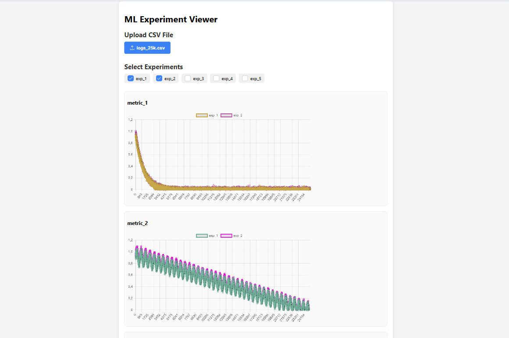

# 📊 MLOps Experiment Viewer

Інтерактивний React-додаток для перегляду метрик з експериментів машинного навчання на основі CSV-файлів. Підтримує
завантаження файлу, вибір експериментів і побудову графіків для кожної метрики.

## 📌 Функціональність

* Завантаження CSV-файлу з експериментальними даними
* Вибір одного або кількох експериментів для перегляду
* Побудова графіків по кожній метриці для вибраних експериментів
* Використано PrimeReact для UI та Chart.js для візуалізації

## 📌 Демо

[Відкрити додаток онлайн](https://run-compare.vercel.app/)

## 📌 Інтерфейс



## 📌 Тестовий CSV-файл

🔗 [Завантажити CSV-файл](https://drive.google.com/file/d/155280Pg2DxRGhhKpHpnenAEovlTbGYUu/view?usp=sharing)

## 📌 Технології

- React + Vite
- PrimeReact (UI-компоненти)
- chart.js через `primereact/chart`
- `papaparse` для CSV

## 📌️ Як запустити локально

```bash
git clone https://github.com/anastasiia-perederii/RunCompare.git
cd RunCompare
npm install
npm run dev
```

🔗 Потім відкрий http://localhost:5173